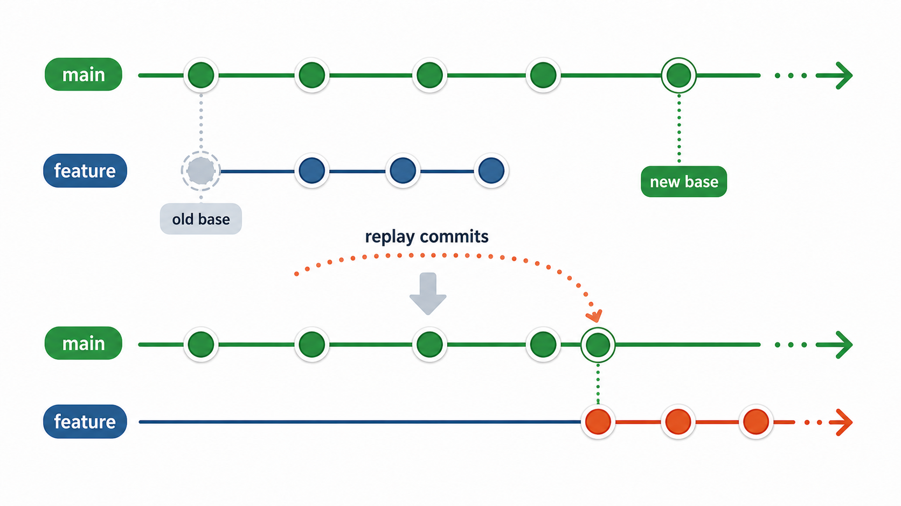
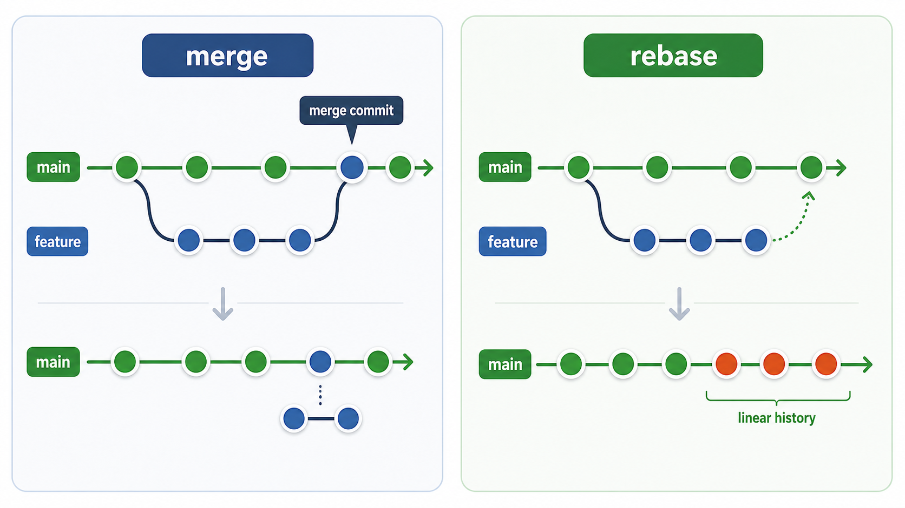
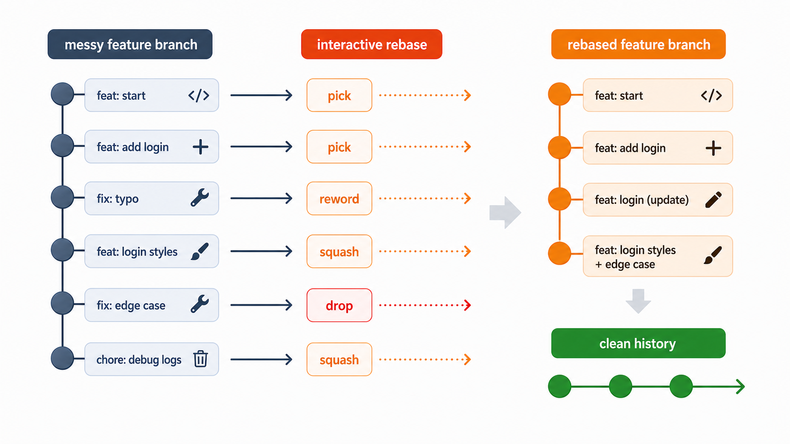

## 一句话先说清楚：什么是 `git rebase`

`git rebase` 的核心作用，是把一串提交从原来的基底上“搬”到另一个新的基底上，并按顺序重新播放这些提交。

它不是简单地“合并代码”，而是：
- 找到你这条分支相对旧基底新增的那些提交
- 切到新的基底上
- 把这些提交一个个重新应用过去

所以 `rebase` 的本质不是“把两条线接起来”，而是“把你这条线改写后，重新接到新的起点上”。

---

## 为什么一定要学 `git rebase`

很多人刚开始学 `Git`，先接触的是 `commit`、`branch`、`merge`。等项目稍微复杂一些，就会开始遇到这些问题：

- 功能分支开发了很多天，`main` 已经往前走了很多
- 提交历史很乱，里面混着 `fix typo`、`debug`、`wip`
- 每次同步主分支都产生一个新的 `merge commit`
- `Pull Request` 的提交记录太碎，不好评审
- 明明代码能用，但历史很难看，很难追

`git rebase` 就是专门解决这类“历史整理”和“基底前移”问题的工具。

### 1. 它能让功能分支基于最新主线继续开发

真实开发里很常见一种情况：

- 你从某个较早的 `main` 拉出 `feature` 分支
- 你开发了三天
- 同事已经往 `main` 合了十几个提交

这时候，如果你还停留在旧基底上继续开发，后面集成时冲突会更集中、更难处理。

`rebase` 可以把你的功能分支搬到最新的 `main` 上，让你基于最新主线继续工作。

### 2. 它能让提交历史更线性、更容易读

有些团队很在意提交历史的可读性，因为历史不是装饰品，而是排查和审计的重要依据。

如果一个功能分支在开发过程中不断：

- `merge main`
- 再改一点
- 再 `merge main`
- 再修一点

最后的历史会非常乱。

而 `rebase` 可以把这些功能提交重新排到最新主线之后，形成更干净的线性历史。

### 3. 它能在合并前先整理你的提交

很多时候，一个功能开发过程里的提交并不适合直接进主分支，例如：

- `fix typo`
- `debug log`
- `try again`
- `临时修一下`

这些提交对你开发时有意义，但对团队长期历史未必有价值。

这时候可以用 `interactive rebase` 把提交整理成更清晰的几条：

- 一个功能提交
- 一个样式修复提交
- 一个测试或边界修复提交

这样别人看历史时，不需要看你整个开发过程里的试错痕迹。

### 4. 它把“开发过程历史”和“最终版本历史”区分开了

这点非常重要。

开发时的历史，往往充满：

- 试验
- 回退
- 局部修补
- 临时日志

但进入长期主分支的历史，最好更像“经过整理后的成果”。

`rebase` 给你的能力就是：

> 开发时可以乱一点，但合入前要把历史整理成别人看得懂的样子。

---

## 一张图看懂：为什么会有 `rebase`



这张图表达的是 `rebase` 最核心的场景：

- 你的 `feature` 分支最初是从旧的 `main` 上拉出来的
- 后来 `main` 往前走了
- 你不想一直停在旧基底上
- 于是把 `feature` 上自己的提交“搬”到新的 `main` 之后

所以 `rebase` 不是为了“炫技”，而是为了让你的工作分支始终跟最新主线对齐。

---

## `merge` 和 `rebase` 到底有什么本质区别

这是学习 `rebase` 时最关键的问题。

### `merge` 的思路

`merge` 的思路是：

- 保留两条分支原本的历史
- 在某个时刻把它们合并起来
- 产生一个新的 `merge commit`（很多场景下会产生）

它强调的是：

- 历史真实保留
- 不改写已有提交
- 分支怎样发展过，就怎样留下痕迹

### `rebase` 的思路

`rebase` 的思路是：

- 找出当前分支比旧基底多出来的那些提交
- 以新的基底为起点
- 把这些提交重新生成一遍并接到新基底后面

它强调的是：

- 历史更线性
- 分支更像一直基于最新主线开发
- 通过“重写提交历史”换来更整洁的结果

### 一张图看懂：`merge` 与 `rebase`



上图左边是 `merge`，右边是 `rebase`。

你可以直接记这个结论：

- `merge`：保留分叉过程
- `rebase`：重排提交，让历史更线性

---

## `git rebase` 最值得理解的一点：它会改写历史

这是 `rebase` 和很多其他 `Git` 命令最大的不同。

当你执行：

```bash
git rebase main
```

表面上看，你只是“把当前分支接到 `main` 后面”。

但实际上发生的是：

- 原来那些提交不会原封不动挪过去
- `Git` 会基于新基底重新创建一批新提交
- 新提交的 `commit hash` 会变化

也就是说，`rebase` 常常不是“移动提交”，而是“重新生成提交”。

这也是为什么大家一直强调：

> 不要随便对已经公开共享的分支做 `rebase`。

因为一旦历史被改写，别人本地引用的旧提交就和你新的提交链对不上了。

---

## `git rebase` 最常见的使用场景

### 1. 功能分支同步最新 `main`

这是最常见、也最实用的场景。

假设你当前在功能分支上：

```bash
git checkout feature/login
git fetch origin
git rebase origin/main
```

这表示：

- 先拿到远程最新状态
- 再把当前分支上自己的提交，重新接到最新的 `origin/main` 后面

### 2. 合并前整理本地提交历史

例如你准备提一个 `Pull Request`，但本地提交是这样：

- `feat: login page`
- `fix typo`
- `debug`
- `fix again`
- `final`

这时候可以用：

```bash
git rebase -i HEAD~5
```

把最近 5 个提交整理成更干净的结构。

### 3. 避免反复产生无意义的 `merge commit`

有些团队不希望功能分支里出现大量“为了同步主分支而产生”的 `merge commit`，因为这会让历史噪音变大。

这时就会更偏向：

- 开发期间使用 `rebase` 同步主分支
- 最终合并时再根据团队策略决定是否 `merge`

### 4. 在合并前先做冲突前置处理

如果一个功能分支长期不更新，最终合并时冲突可能一次性爆发。

而如果你在开发过程中定期 `rebase` 到最新主线，就能更早暴露冲突、分批解决冲突。

---

## 最常用的命令形式

### 1. 把当前分支 `rebase` 到指定分支上

```bash
git rebase main
```

意思是：

- 以 `main` 作为新的基底
- 重新播放当前分支自己的提交

### 2. 基于远程主分支做 `rebase`

```bash
git fetch origin
git rebase origin/main
```

这个形式更常见，也更安全，因为它明确使用远程最新主线。

### 3. 交互式 `rebase`

```bash
git rebase -i HEAD~5
```

表示对最近 5 个提交进行交互式整理。

### 4. `rebase` 过程中冲突后继续

```bash
git rebase --continue
```

### 5. `rebase` 过程中放弃

```bash
git rebase --abort
```

### 6. `rebase` 过程中跳过当前提交

```bash
git rebase --skip
```

这个命令要谨慎，因为它表示当前冲突的那次提交直接不应用了。

---

## 一套最常用的工作流

### 场景：把 `feature/login` 同步到最新 `main`

### 1. 切到你的功能分支

```bash
git checkout feature/login
```

### 2. 先更新远程信息

```bash
git fetch origin
```

### 3. 执行 `rebase`

```bash
git rebase origin/main
```

### 4. 如果有冲突，逐个解决

解决冲突后：

```bash
git add .
git rebase --continue
```

如果还有冲突，就继续：

- 修改冲突文件
- `git add`
- `git rebase --continue`

直到整个 `rebase` 完成。

### 5. 如果这是你已经推送过的分支，更新远程时要特别小心

因为 `rebase` 改写了历史，后续通常需要：

```bash
git push --force-with-lease
```

注意这里推荐 `--force-with-lease`，而不是直接 `--force`。

原因是前者会多做一层保护，避免你把别人刚推上去的内容直接顶掉。

---

## `interactive rebase` 是什么，为什么很重要

如果说普通 `rebase` 主要解决“换基底”问题，那么 `interactive rebase` 主要解决“整理提交历史”问题。

它让你在提交进入长期历史之前，先做一次人工清洗。

最常见的入口是：

```bash
git rebase -i HEAD~5
```

这表示：

- 打开最近 5 个提交的编辑列表
- 你可以决定每个提交如何处理

### 一张图看懂：`interactive rebase`



这张图表达的是：

- 原始功能分支上有很多零碎提交
- 通过 `interactive rebase`
- 你可以挑选、改名、合并、删除这些提交
- 最终得到一条更干净的历史

### 最常见的动作

#### 1. `pick`

保留这个提交。

#### 2. `reword`

保留提交内容，但修改提交说明。

#### 3. `edit`

停在这个提交上，让你修改提交内容。

#### 4. `squash`

把当前提交和前一个提交合并，并允许你编辑合并后的提交说明。

#### 5. `fixup`

把当前提交和前一个提交合并，但直接丢弃当前提交说明。

#### 6. `drop`

删除这个提交，不再保留。

---

## 为什么很多团队会要求：合并前先整理提交

这背后不是“形式主义”，而是工程质量问题。

### 1. 提交历史本身就是沟通界面

别人 `review` 你的代码时，第一眼看到的不只是文件改动，还有提交历史。

如果历史是：

- `wip`
- `try`
- `fix`
- `again`
- `final final`

别人很难判断你每一步到底做了什么。

而如果历史是：

- `feat: add login form`
- `feat: add validation`
- `fix: handle empty token`

别人读起来就轻松很多。

### 2. 干净历史更利于回滚和定位问题

如果一个功能被拆成几条语义明确的提交，那么：

- 看 `git log` 更清楚
- 做 `git bisect` 更友好
- 出问题时更容易判断是哪次改动引入的

### 3. 它把“试错过程”留给自己，把“结果历史”留给团队

开发过程中你可以自由试验，但进入主线前最好把历史整理成：

- 有明确语义
- 有合理颗粒度
- 没有明显噪音

这就是 `interactive rebase` 最有价值的地方。

---

## `git rebase` 过程中发生冲突怎么办

这是实际使用里最常见的问题。

### 当冲突发生时，通常会出现什么

执行：

```bash
git rebase origin/main
```

如果冲突了，`Git` 会停下来，并告诉你当前是哪一个提交在应用时失败了。

这时你要做的不是慌，而是按固定流程处理。

### 标准处理流程

#### 1. 查看冲突文件

```bash
git status
```

#### 2. 打开文件，解决冲突标记

常见冲突标记类似：

```text
<<<<<<< HEAD
主线内容
=======
当前提交内容
>>>>>>> commit
```

你需要手动决定保留哪部分，或者把两边合理合并。

#### 3. 标记冲突已解决

```bash
git add <file>
```

#### 4. 继续 `rebase`

```bash
git rebase --continue
```

#### 5. 如果不想继续了，就终止

```bash
git rebase --abort
```

这会把仓库状态尽量恢复到本次 `rebase` 开始之前。

### `--skip` 什么时候用

```bash
git rebase --skip
```

它的含义是：

- 当前这次提交不要了
- 直接跳过，继续后面的提交

只有在你非常确定“这次提交可以丢”时才用，否则容易把功能跳没。

---

## `rebase` 和 `merge` 该怎么选

这不是非黑即白的问题，关键是看你的目标。

### 想保留真实分叉历史时，优先考虑 `merge`

适合场景：

- 公共分支集成
- 不想改写历史
- 团队要求完整保留分支演进过程

### 想让历史更线性、更整洁时，优先考虑 `rebase`

适合场景：

- 本地功能分支整理
- 合并前清洗提交
- 同步最新主线但不想反复制造 `merge commit`

### 一个很实用的经验判断

- 对自己的本地功能分支：可以大胆使用 `rebase`
- 对已经共享给团队的公共分支：默认谨慎，优先确认再做

---

## 最重要的边界：不要轻易 `rebase` 已经公开共享的历史

这是 `git rebase` 最重要的使用纪律。

### 为什么危险

因为 `rebase` 会重写历史。

假设你和同事都基于同一条远程分支工作：

- 你本地执行了 `rebase`
- 你把改写后的历史强推上远程
- 同事本地还保留着旧历史

这时大家的提交链就分叉了，而且不是普通分叉，而是“旧历史”和“新历史”不兼容。

后果通常包括：

- 同事拉代码变得复杂
- 容易出现重复提交
- 容易误删别人提交
- 历史变得更难收拾

### 哪些分支默认不要乱 `rebase`

- 团队共用的长期开发分支
- 已经被多人基于其继续开发的分支
- 已经发布或已经作为稳定基线的分支

### 哪些分支通常可以安全 `rebase`

- 你自己的本地功能分支
- 还没被别人依赖的短期分支
- 合并前准备整理历史的个人工作分支

---

## `git pull --rebase` 是什么

很多人还会遇到这个命令：

```bash
git pull --rebase
```

它的含义是：

- 先从远程抓最新内容
- 然后不是直接 `merge`
- 而是把你本地尚未推送的提交，`rebase` 到最新远程提交之后

它常用于避免日常 `pull` 时制造不必要的 `merge commit`。

不过使用前要知道自己的团队策略，因为有些团队希望统一使用普通 `merge` 流程。

---

## `rebase` 之后为什么常常需要 `push --force-with-lease`

因为 `rebase` 改写了本地提交历史。

远程原来记录的是旧提交链，而你本地变成了新提交链，普通 `push` 往往会失败。

这时通常需要：

```bash
git push --force-with-lease
```

这里特别强调不要默认写成：

```bash
git push --force
```

`--force-with-lease` 比 `--force` 更安全，因为它会在覆盖前先确认远程分支是不是还处于你预期的状态。

---

## 常见误区与坑

### 1. 以为 `rebase` 只是“另一种 `merge`”

不是。

`merge` 的核心是“合并历史”，`rebase` 的核心是“重写并重排历史”。

### 2. 以为 `rebase` 不会改 `commit hash`

不对。

只要它重新生成了提交，新的 `commit hash` 就会变。

### 3. 以为 `rebase` 后一定没有冲突

也不对。

`rebase` 不是“免冲突”，而是“把冲突放到重新播放提交的过程中逐个处理”。

### 4. 冲突时直接用 `--skip`

这很危险。

除非你完全确定当前提交可以不要，否则不要轻易跳过。

### 5. 对公共分支随意 `rebase` 再强推

这是最常见的大坑之一。

公开历史被改写后，团队其他人的本地状态会非常难受。

---

## 推荐实践

### 1. 开发中的个人功能分支，定期 `rebase` 到最新主线

这样可以更早发现冲突，也能减少最后一次性集成的压力。

### 2. 提交 `Pull Request` 前，用 `interactive rebase` 整理本地历史

这样代码评审体验会好很多。

### 3. 对共享分支保持克制

只在你明确知道影响范围时，才去改写已经公开的历史。

### 4. 强推时优先使用 `--force-with-lease`

它不是绝对安全，但比无脑 `--force` 好得多。

### 5. 把 `rebase` 当作“历史整理工具”，而不是“万能命令”

它很强，但有边界。

用对了，它能让历史很干净；用错了，它能让协作很痛苦。

---

## 最小可用命令清单

如果你只想先掌握最常用的几条，记这组就够了：

```bash
git fetch origin
git rebase origin/main
git rebase -i HEAD~5
git rebase --continue
git rebase --abort
git push --force-with-lease
```

---

## 总结

`git rebase` 的核心价值，不是“历史看起来更高级”，而是：

- 让功能分支跟上最新主线
- 让提交历史更线性
- 让合并前的提交更干净
- 让长期主线更容易阅读和维护

但它的代价也非常明确：

- 会改写历史
- 会改变 `commit hash`
- 对共享分支使用不当会破坏协作

如果只记一句话，可以记这句：

> `merge` 更偏向保留真实历史，`rebase` 更偏向整理历史。
