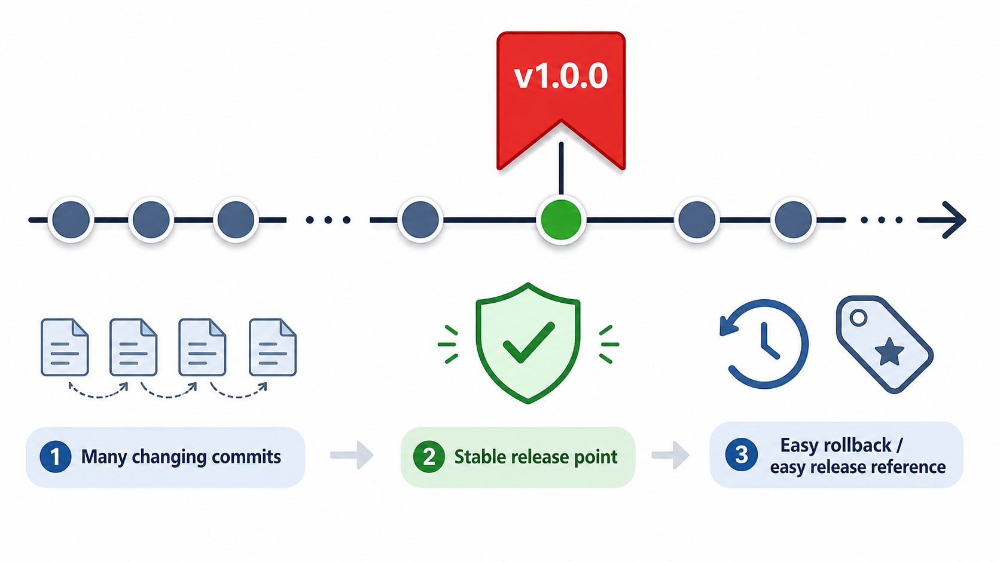
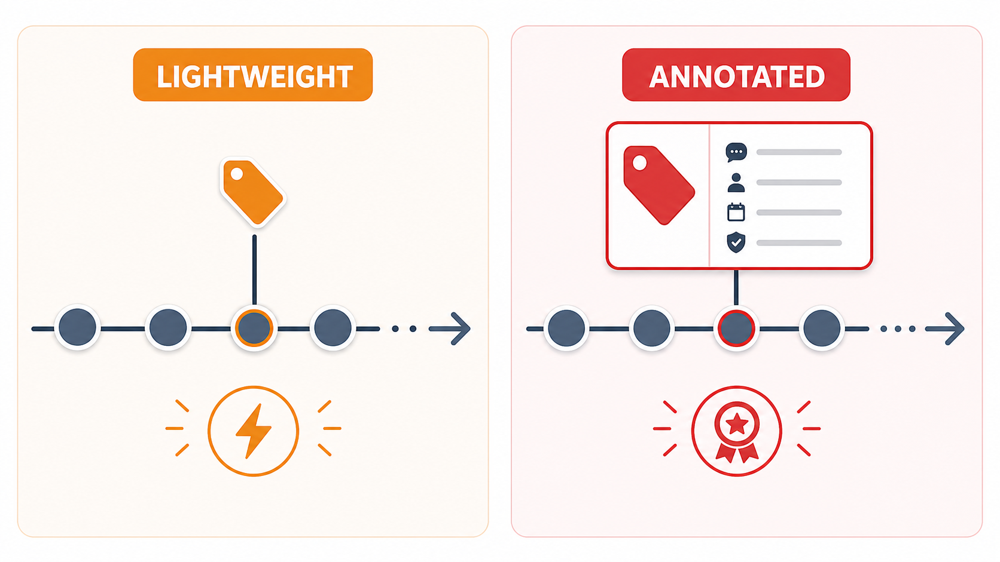
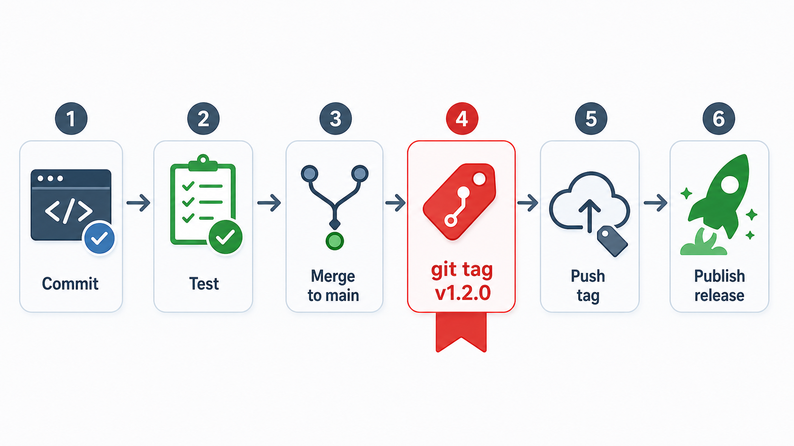

## 一句话先说清楚：什么是 `git tag`

`git tag` 的作用，是给某一个**已经存在的提交（`commit`）打一个稳定、可读、可传播的名字**。

比如你可以把某次提交标记为：

- `v1.0.0`
- `v1.2.3`
- `release-2026-05-09`
- `ios-online-hotfix-1`

它本质上不是“产生新代码”，而是“给历史上的某个关键节点做永久标记”。

---

## 为什么一定要学 `git tag`

很多人刚开始学 `Git`，只会用 `commit`、`branch`、`merge`，觉得 `tag` 好像只是“锦上添花”。其实不是。

`git tag` 真正解决的是这几个非常现实的问题：

### 1. `commit hash` 太难记，也不适合对外沟通

提交本来就能唯一定位代码，例如：

```bash
git checkout 3f6c1a8
```

问题是：

- `hash` 不可读
- 团队沟通成本高
- 过一段时间没人记得它代表什么
- 产品、测试、运维更不可能记住一串 `hash`

而如果你说：

```bash
git checkout v1.2.0
```

意思立刻就明确了。

### 2. 分支会移动，`tag` 更适合表示“历史里已经确定的版本”

分支名本质上是一个“会向前移动的指针”。

例如 `main`、`develop`、`release`，随着新提交出现，它们的指向都会变化。

但版本发布场景通常需要的是：

- 这个版本当时到底是哪份代码
- 以后还能不能百分百找回来
- 测试通过的那个版本，和线上发布的那个版本，是不是同一个点

这时候不能只靠分支，因为分支会继续演进。`tag` 更适合表达：

- 这个点已经确认过
- 这个点就是某个版本
- 这个点以后不应该再变

### 3. 发布、回滚、追责、排查，都需要一个稳定版本锚点

没有 `tag` 的项目，常见情况是：

- “线上 `v2.3.1` 到底对应哪个 `commit`？”
- “上次测试通过的是哪个版本？”
- “这个 `bug` 是从哪个版本开始出现的？”
- “要紧急回滚，回到哪个代码点最安全？”

如果项目从发布开始就坚持打 `tag`，这些问题会简单很多。

### 4. `GitHub` / `GitLab` 的 `Release` 能力，通常也是围绕 `tag` 建立的

很多平台的 `Release` 页面，本质上就是：

- 先有一个 `tag`
- 再围绕这个 `tag` 补发布说明、二进制包、更新日志

所以 `tag` 不只是本地 `Git` 小技巧，它直接关系到正式版本管理。

---

## 一张图看懂：`git tag` 为什么存在



上图表达的核心是：

- 日常开发提交很多，而且一直在变化
- 但某些提交代表“稳定可发布版本”
- 给这个提交打上 `v1.0.0` 这样的标签后，团队就能用一个稳定名字反复引用它

换句话说，`tag` 的价值不是“让 `Git` 更炫”，而是让**版本本身可识别、可回溯、可沟通、可回滚**。

---

## `commit`、`branch`、`tag` 到底有什么区别

| 对象 | 本质 | 会不会移动 | 典型用途 |
| --- | --- | --- | --- |
| `commit` | 一次提交快照 | 不会 | 表示某一份具体代码 |
| `branch` | 指向某个提交的可移动指针 | 会 | 持续开发 |
| `tag` | 指向某个提交的稳定标记 | 通常不动 | 版本发布、里程碑记录 |

可以这样理解：

- `commit` 是历史里的一个点
- `branch` 是会继续往前走的路线标记
- `tag` 是给某个关键历史点插上的纪念牌

---

## `git tag` 最常见的使用场景

### 1. 正式版本发布

例如：

```bash
git tag -a v1.0.0 -m "First stable release"
git push origin v1.0.0
```

之后所有人都知道：

- `v1.0.0` 就是第一版正式发布代码

### 2. 测试验收版本冻结

测试环境通过后，可以给该提交打标签：

```bash
git tag -a test-pass-2026-05-09 -m "QA passed"
```

这样后面出现争议时，可以精准找到“测试通过的到底是哪份代码”。

### 3. 线上问题回滚

如果线上当前版本出问题，而上一个稳定版本有 `tag`：

```bash
git checkout v1.1.3
```

或基于它拉一个修复分支：

```bash
git checkout -b hotfix-from-v1.1.3 v1.1.3
```

会比“翻半天提交记录找那次正确 `commit`”高效得多。

### 4. 重大里程碑记录

不一定非得是正式版本，也可以是：

- `prototype-demo`
- `customer-review-1`
- `migration-finished`
- `ohos-first-pass`

前提是：这些点以后值得被反复引用。

---

## `git tag` 的两种核心类型

`Git` 标签最重要的是两类：

- 轻量标签（`lightweight tag`）
- 附注标签（`annotated tag`）



### 1. 轻量标签 `lightweight tag`

轻量标签可以理解成：

- 只是给某个 `commit` 起了一个别名
- 很轻
- 很快
- 没有额外说明信息

创建方式：

```bash
git tag v1.0.0
```

它更适合：

- 临时定位
- 本地快速标记
- 对说明信息要求不高的场景

### 2. 附注标签 `annotated tag`

附注标签会额外保存更多元数据，例如：

- 标签名
- 创建者
- 创建时间
- 标签说明
- 可选签名信息

创建方式：

```bash
git tag -a v1.0.0 -m "First stable release"
```

它更适合：

- 正式版本发布
- 团队协作
- 需要长期保留历史说明的场景

### 3. 实际工作中该选哪个

如果你是在正式项目里做版本管理，**优先使用附注标签**。

原因很简单：

- 它信息更完整
- 可读性更高
- 更适合团队协作
- 更像“发布记录”，而不只是一个本地快捷方式

一句经验结论：

- 临时用途：可以轻量标签
- 发布版本：优先附注标签

---

## 常用命令总表

### 1. 查看所有 `tag`

```bash
git tag
```

如果标签很多，可以配合排序：

```bash
git tag --sort=-version:refname
```

这个命令很适合查看类似 `v1.9.0`、`v1.10.0` 这样的版本号。

### 2. 创建轻量标签

```bash
git tag v1.0.0
```

默认打在当前 `HEAD` 指向的提交上。

### 3. 创建附注标签

```bash
git tag -a v1.0.0 -m "First stable release"
```

### 4. 给历史提交打 `tag`

先查提交：

```bash
git log --oneline
```

然后把 `tag` 打到指定提交上：

```bash
git tag -a v1.0.0 3f6c1a8 -m "Release v1.0.0"
```

这点很重要：`tag` 不一定非要在“当前提交”上创建，它完全可以补打到历史节点。

### 5. 查看某个 `tag` 的详细信息

```bash
git show v1.0.0
```

如果是附注标签，你会看到：

- 标签作者
- 标签日期
- 标签说明
- 对应提交信息

### 6. 按模式筛选 `tag`

```bash
git tag -l "v1.2.*"
```

### 7. 删除本地 `tag`

```bash
git tag -d v1.0.0
```

### 8. 推送单个 `tag` 到远程

```bash
git push origin v1.0.0
```

### 9. 一次推送全部 `tag`

```bash
git push origin --tags
```

这个命令要谨慎，因为它会把本地所有标签都推到远程。

### 10. 删除远程 `tag`

```bash
git push origin :refs/tags/v1.0.0
```

或者：

```bash
git push origin --delete v1.0.0
```

---

## 为什么很多团队会要求“发版必须打 `tag`”

这是 `git tag` 最值得真正理解的一部分。

### 1. 它把“代码开发”与“版本发布”明确分开

开发过程中，你可能每天提交很多次：

- 修 `bug`
- 改文案
- 调接口
- 做实验性修改

但并不是每个 `commit` 都值得被叫作“版本”。

`tag` 的意义，就是明确地说：

> 历史上有很多提交，但只有某些提交，被正式认定为一个版本。

这在团队协作里非常关键。

### 2. 它提供了一个稳定的跨角色沟通坐标

开发说：

- “问题出在 `v2.1.4` 之后”

测试说：

- “我验证通过的是 `v2.1.3`”

运维说：

- “线上现在跑的是 `v2.1.2`”

产品说：

- “客户现场演示用的是 `v2.1.0`”

如果没有 `tag`，这些对话很快就会退化成：

- “应该是上周三那个提交吧？”
- “不是，是你后来又合了一次修复。”
- “具体是哪一个 `hash`？”

沟通成本会瞬间上升。

### 3. 它让“回滚”和“追问题”变成可操作动作

版本管理里最怕的不是出问题，而是：

- 不知道问题从哪版开始
- 不知道该回到哪一版
- 不知道某个包到底从哪份代码构建出来

`tag` 的存在，直接把抽象问题变成可执行命令：

```bash
git checkout v1.3.2
git diff v1.3.2..v1.3.3
git log v1.3.2..v1.3.3 --oneline
```

这就是它的真正工程价值。

### 4. 它是“版本历史”而不是“开发过程历史”

`git log` 更像开发历史。

`git tag` 更像版本历史。

这两个维度不一样：

- 开发历史关注“做了哪些改动”
- 版本历史关注“哪些改动被正式定义为版本”

成熟项目两者都需要。

---

## 一张图看懂：`tag` 在发布流程里的位置



最典型的发布链路就是：

1. 开发完成并提交代码
2. 测试验证
3. 合并到主分支
4. 创建正式 `tag`
5. 推送 `tag` 到远程
6. 平台或团队基于 `tag` 发布版本

这里面最容易被忽略的一点是：

**发布不是“`merge` 到 `main` 就结束了”，而是“对将要发布的那个提交做版本确认”。**

这个“确认动作”，很多团队就是靠 `tag` 完成的。

---

## 一套推荐的发版流程

下面是一套简单、实用、团队里最常见的做法。

### 场景：准备发布 `v1.2.0`

### 1. 确认当前代码已经合并到主分支

```bash
git checkout main
git pull origin main
```

### 2. 确认当前提交就是要发布的版本

```bash
git log --oneline -n 5
```

### 3. 创建附注标签

```bash
git tag -a v1.2.0 -m "Release v1.2.0"
```

### 4. 把标签推送到远程

```bash
git push origin v1.2.0
```

### 5. 如果平台需要，再基于 `tag` 创建 `Release`

例如 `GitHub` / `GitLab` 上：

- 选中 `v1.2.0`
- 填写发布说明
- 上传构建产物

这样这个版本的代码、说明、产物三者就关联起来了。

---

## `tag` 和分支的一个关键误区

很多初学者容易把 `tag` 当成“另一种分支”。这不对。

### 分支的目标

分支是为了继续开发，所以它会移动。

例如：

```bash
git checkout -b feature/login
```

后续你再提交，`feature/login` 会一直指向最新提交。

### `tag` 的目标

`tag` 是为了固定历史节点，所以它通常不应该移动。

例如：

```bash
git tag -a v1.0.0 -m "Release v1.0.0"
```

这意味着：

- `v1.0.0` 表示的版本已经被确认
- 以后不应该悄悄改成别的提交

所以一个简单判断标准是：

- 你要“继续往前开发”：用 `branch`
- 你要“把这个点固定下来”：用 `tag`

---

## `tag` 命名建议

### 1. 最常见命名：语义化版本号

```text
v1.0.0
v1.2.3
v2.0.0
```

通常含义是：

- `MAJOR`：不兼容变更
- `MINOR`：兼容性新增
- `PATCH`：兼容性修复

### 2. 内部测试版本

```text
test-2026-05-09
qa-pass-2026-05-09
demo-1
```

### 3. 热修复版本

```text
v1.2.1-hotfix.1
v1.2.1-hotfix-login
```

### 4. 命名建议原则

- 同一项目保持统一规则
- 不要今天 `v1.0.0`、明天 `release_final_ok`
- 对外版本和内部测试版本最好区分清楚
- 尽量让 `tag` 一眼能看出用途

---

## `annotated tag` 为什么更适合正式版本

再强调一次，正式发版时更推荐：

```bash
git tag -a v1.2.0 -m "Release v1.2.0"
```

而不是：

```bash
git tag v1.2.0
```

原因主要有四个：

### 1. 它自带说明信息

几年之后你再看，仍然知道这是干什么的。

### 2. 它更适合审计和团队协作

别人可以通过 `git show <tag>` 看出：

- 谁打的 `tag`
- 什么时候打的
- 为什么打

### 3. 它更符合“发布记录”的语义

正式发布不只是“起个名字”，而是“形成一条可追溯记录”。

### 4. 它可以进一步配合签名

如果团队有更高要求，还可以使用签名标签：

```bash
git tag -s v1.2.0 -m "Signed release v1.2.0"
```

这适合对发布可信度要求更高的项目。

---

## 远程 `tag` 相关知识

这里有一个很重要的点：**`git push` 默认不一定会把 `tag` 一起推上去。**

所以你本地打完 `tag` 后，别人未必马上能看到。

### 推送单个 `tag`

```bash
git push origin v1.2.0
```

### 推送全部 `tag`

```bash
git push origin --tags
```

### 拉取远程 `tag`

```bash
git fetch --tags
```

如果你发现：

- 本地明明有 `tag`
- 远程仓库看不到

优先检查是不是忘记 `push tag` 了。

---

## 常见排查命令

### 看两个版本之间改了什么

```bash
git diff v1.2.0..v1.2.1
```

### 看两个版本之间有哪些提交

```bash
git log v1.2.0..v1.2.1 --oneline
```

### 查看当前提交距离最近 `tag` 多远

```bash
git describe --tags
```

这个命令在构建版本号、排查发布基线时很有用。

---

## 常见误区与坑

### 1. 以为 `tag` 会自动跟着分支走

不会。

`tag` 一旦打在某个提交上，就固定在那个提交上。

### 2. 以为 `tag` 只能打在当前提交

不是。

它完全可以补打到历史提交。

### 3. 本地删了 `tag`，以为远程也删了

不是。

本地删除：

```bash
git tag -d v1.0.0
```

远程还需要单独删：

```bash
git push origin --delete v1.0.0
```

### 4. 发布用轻量标签，后面信息不够用

短期看没问题，长期看经常后悔。

所以正式版本尽量使用附注标签。

### 5. 随意改动已经公开发布的 `tag`

这是团队协作里比较忌讳的行为。

因为别人可能已经基于这个 `tag`：

- 拉代码
- 打包
- 部署
- 写文档

如果你把同名 `tag` 改指向到别的提交，会造成版本混乱。

如果必须修正，最好：

- 明确通知团队
- 优先考虑新建一个新 `tag`，而不是偷偷覆盖旧 `tag`

---

## 推荐实践

### 1. 正式版本统一使用附注标签

```bash
git tag -a vX.Y.Z -m "Release vX.Y.Z"
```

### 2. `tag` 命名规则提前定好

比如统一用：

```text
v主版本.次版本.修订号
```

### 3. 发版流程里把“创建并推送 `tag`”写成固定步骤

不要靠人记忆。

### 4. 不要随意重写已公开的 `tag`

版本锚点的可信度，比省一次命名更重要。

### 5. 发布说明写在 `tag message` 或 `Release` 页面里

这样回头看版本历史时，信息会完整很多。

---

## 最小可用命令清单

如果你只想先掌握最常用的 5 个命令，记这组就够了：

```bash
git tag
git tag -a v1.0.0 -m "Release v1.0.0"
git show v1.0.0
git push origin v1.0.0
git push origin --delete v1.0.0
```

---

## 总结

`git tag` 的核心价值，不是“多了一个 `Git` 命令”，而是：

- 给重要提交一个稳定名字
- 让版本可以被准确引用
- 让发布过程有明确锚点
- 让回滚、排查、对账都更容易

所以从工程实践上看，`tag` 解决的是**版本管理问题**，不是单纯的**代码提交问题**。

如果只记一句话，可以记这句：

> `branch` 用来继续开发，`tag` 用来固定版本。
