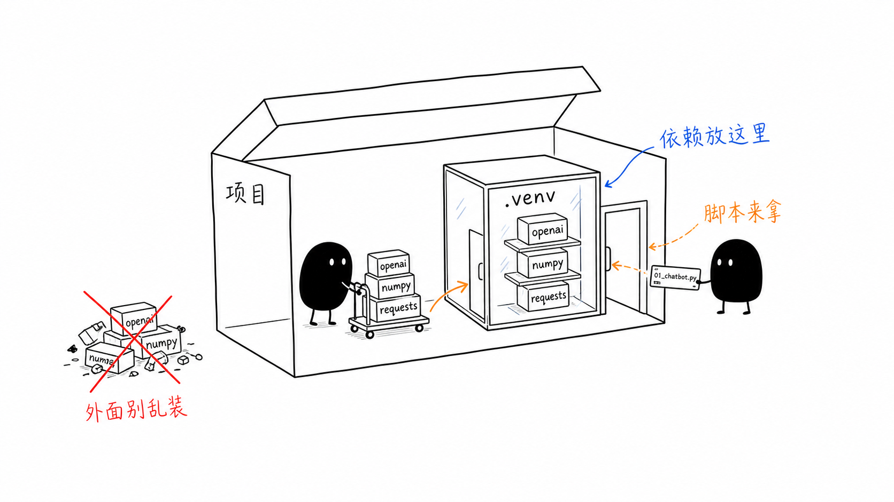
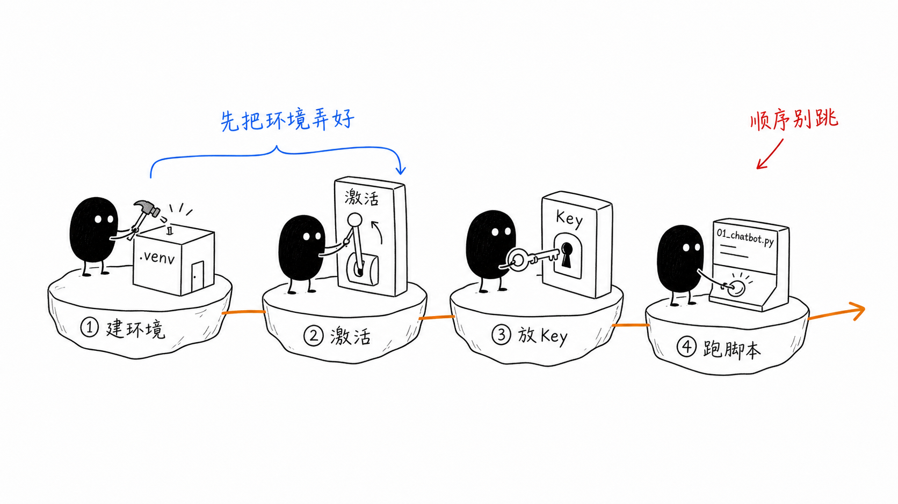
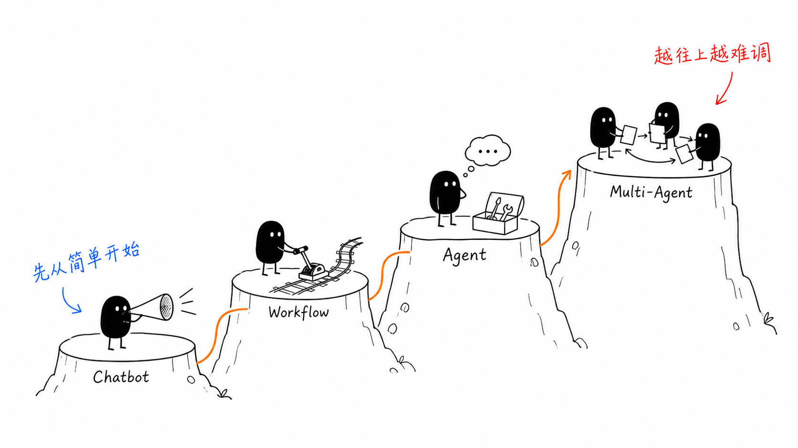

# `DeepSeek` 示例脚本从零运行指南（小白版）

这份指南是给第一次接触这组示例脚本的人准备的。目标很简单：**让你从零开始，把本地环境准备好，然后顺利跑通 4 个 `DeepSeek` 示例脚本。**

你不需要先懂 `Agent`、`Workflow` 或 `Python` 环境管理。照着本文一步一步做，就能先跑起来，再慢慢理解每个脚本的区别。

## 一、你会用到哪些文件

这组示例放在当前目录下：

```text
raw/C_Courses(课程)/A_Agent Learning Hub/Stage 0：理解 Agent 是什么/codes
```

里面最重要的文件有 6 个：

- `bootstrap_env.sh`
  - 作用：帮你创建本地 `.venv`，并安装依赖。
- `requirements.txt`
  - 作用：声明依赖。当前核心依赖就是 `openai`。
- `01_chatbot_deepseek.py`
  - 作用：最简单的对话脚本。
- `02_workflow_deepseek.py`
  - 作用：固定流程版示例。
- `03_agent_deepseek.py`
  - 作用：带工具调用的 `Agent` 示例。
- `04_multi_agent_deepseek.py`
  - 作用：多角色协作的 `Multi-Agent` 示例。

## 二、先理解一件事：为什么要有本地 `.venv`

你会看到这个目录下有一个 `.venv`。它不是“第二套 `Python`”，而是**这个项目自己的小工作间**：脚本要用的依赖都装在里面，不会乱装到别的地方。



你可以把它理解成：

- 项目是一个房间
- `.venv` 是房间里的工具柜
- `openai` 这类依赖都放进工具柜
- 脚本运行时只去自己的工具柜里拿工具

这样做的好处是：

- 不会污染你别的 `Python` 项目
- 别的项目升级或卸载包时，不容易互相影响
- 这组示例跟着这个目录走，迁移更清楚

另外，仓库根目录的 `.gitignore` 已经加了 `.venv/`，所以本地环境不会被提交到 `git`。

## 三、第一次运行，最短只做四步

如果你只想先把脚本跑起来，直接做下面四步。



### 第 1 步：进入仓库根目录

```bash
cd "/Users/peijianbo/Documents/MeMe/AI-Master"
```

### 第 2 步：创建本地环境并安装依赖

```bash
bash "raw/C_Courses(课程)/A_Agent Learning Hub/Stage 0：理解 Agent 是什么/codes/bootstrap_env.sh"
```

这一步会自动做三件事：

- 使用你当前机器里的 `python3`
- 在 `codes/.venv` 下创建本地虚拟环境
- 按 `requirements.txt` 安装依赖

当前 `requirements.txt` 的核心依赖是：

```text
openai>=1.30.0,<2.0.0
```

所以你如果心里想的是“这里是不是要安装 `openai`？”，答案是：**要，而且这一步已经帮你装了。**

如果你已经激活了 `.venv`，也可以手动安装：

```bash
python -m pip install openai
```

### 第 3 步：激活本地 `.venv`

```bash
source "raw/C_Courses(课程)/A_Agent Learning Hub/Stage 0：理解 Agent 是什么/codes/.venv/bin/activate"
```

激活成功后，终端前面通常会出现 `(.venv)`。

### 第 4 步：配置 `DeepSeek` 的 `API Key`

```bash
export DEEPSEEK_API_KEY="你的 DeepSeek Key"
```

没有这一步，脚本会报错，因为它不知道用哪个 `Key` 去访问 `DeepSeek`。

## 四、先跑哪一个脚本最合适

第一次建议按下面顺序体验，不要一上来就跑最复杂的：



1. `01_chatbot_deepseek.py`
2. `02_workflow_deepseek.py`
3. `03_agent_deepseek.py`
4. `04_multi_agent_deepseek.py`

原因很简单：

- 第一个脚本最像“普通聊天”
- 第二个脚本开始出现“固定流程”
- 第三个脚本开始出现“模型自己决定要不要调工具”
- 第四个脚本才进入“多个角色协作”

按这个顺序最容易理解复杂度是怎么一层层加上去的。

## 五、四个脚本分别怎么运行

下面所有命令，都默认你已经：

- 进入了仓库根目录
- 激活了 `codes/.venv`
- 设置了 `DEEPSEEK_API_KEY`

### 1. 运行 `Chatbot` 示例

```bash
python "raw/C_Courses(课程)/A_Agent Learning Hub/Stage 0：理解 Agent 是什么/codes/01_chatbot_deepseek.py"
```

它会做什么：

- 进入一个命令行对话循环
- 你输入一句话
- 它调用一次 `DeepSeek`
- 把回复打印出来

怎么退出：

- 输入 `exit`
- 或输入 `quit`

适合谁先跑：

- 完全第一次接触这组脚本的人
- 只想验证环境和 `Key` 是否正常的人

### 2. 运行 `Workflow` 示例

```bash
python "raw/C_Courses(课程)/A_Agent Learning Hub/Stage 0：理解 Agent 是什么/codes/02_workflow_deepseek.py"
```

它会做什么：

- 先让模型判断用户意图
- 然后进入固定路径之一：
- `refund`
- `complaint`
- `inquiry`

这个脚本的重点不是“自由”，而是“流程提前写好”。  
也就是说，**模型只负责局部判断，流程本身不是模型临时发明的。**

为了让你能直接跑通，这个脚本里的订单查询、工单创建、知识库检索都做成了本地 `mock`。

### 3. 运行 `Agent` 示例

```bash
python "raw/C_Courses(课程)/A_Agent Learning Hub/Stage 0：理解 Agent 是什么/codes/03_agent_deepseek.py"
```

它会做什么：

- 你先输入一个问题
- 模型会判断要不要调用工具
- 如果要，就调用本地工具，再继续思考
- 最后再给出最终回答

这个脚本里内置了两个工具：

- `web_search`
- `run_python`

你会在终端中看到工具调用日志，例如：

```text
[工具] web_search({...}) -> ...
```

这正是 `Agent` 和普通 `Chatbot` 的关键差异：  
**不是只回答，而是边做边决定下一步。**

### 4. 运行 `Multi-Agent` 示例

```bash
python "raw/C_Courses(课程)/A_Agent Learning Hub/Stage 0：理解 Agent 是什么/codes/04_multi_agent_deepseek.py"
```

它会做什么：

- 先让主控角色拆任务
- 主控角色会生成一个 `JSON` 计划
- 然后把步骤分发给不同角色
- 最后再由 `writer` 汇总

当前脚本里用到的角色有：

- `researcher`
- `coder`
- `writer`

这个脚本适合在你已经理解前三个之后再跑。否则你很容易只看到“调用更多”，却没看懂“为什么这里需要多个角色”。

## 六、推荐你真正照抄的一套命令

如果你今天只想把第一条链路跑通，直接抄下面这段：

```bash
cd "/Users/peijianbo/Documents/MeMe/AI-Master"
bash "raw/C_Courses(课程)/A_Agent Learning Hub/Stage 0：理解 Agent 是什么/codes/bootstrap_env.sh"
source "raw/C_Courses(课程)/A_Agent Learning Hub/Stage 0：理解 Agent 是什么/codes/.venv/bin/activate"
export DEEPSEEK_API_KEY="你的 DeepSeek Key"
python "raw/C_Courses(课程)/A_Agent Learning Hub/Stage 0：理解 Agent 是什么/codes/01_chatbot_deepseek.py"
```

如果你已经跑过一次环境，后续通常只要执行：

```bash
cd "/Users/peijianbo/Documents/MeMe/AI-Master"
source "raw/C_Courses(课程)/A_Agent Learning Hub/Stage 0：理解 Agent 是什么/codes/.venv/bin/activate"
export DEEPSEEK_API_KEY="你的 DeepSeek Key"
python "raw/C_Courses(课程)/A_Agent Learning Hub/Stage 0：理解 Agent 是什么/codes/03_agent_deepseek.py"
```

## 七、最常见的三个报错

### 1. `ModuleNotFoundError: No module named 'openai'`

这说明通常有两种可能：

- 你还没创建本地 `.venv`
- 你创建了，但没有激活

直接重做下面两步：

```bash
bash "raw/C_Courses(课程)/A_Agent Learning Hub/Stage 0：理解 Agent 是什么/codes/bootstrap_env.sh"
source "raw/C_Courses(课程)/A_Agent Learning Hub/Stage 0：理解 Agent 是什么/codes/.venv/bin/activate"
```

### 2. `KeyError: 'DEEPSEEK_API_KEY'`

说明你还没设置 `DeepSeek` 的 `Key`：

```bash
export DEEPSEEK_API_KEY="你的 DeepSeek Key"
```

### 3. 接口调用失败，但不是本地环境报错

优先检查这三件事：

- `DEEPSEEK_API_KEY` 是否正确
- 当前网络能否访问 `https://api.deepseek.com`
- 账号是否还有额度

## 八、什么时候需要重新执行 `bootstrap_env.sh`

下面这些情况，建议重新执行一次：

- 你刚把 `codes/.venv` 删除了
- `requirements.txt` 被更新了
- 你怀疑本地环境装坏了
- 换了一台机器

如果只是普通继续运行脚本，通常不需要每次都重建环境。

## 九、最后给新手的一个建议

第一次不要同时理解太多概念。  
先把脚本跑通，再去看“为什么它是 `Chatbot` / `Workflow` / `Agent` / `Multi-Agent`”。

你只要记住这条路线就够了：

1. 先建 `.venv`
2. 再激活 `.venv`
3. 再设置 `DEEPSEEK_API_KEY`
4. 先跑 `01_chatbot_deepseek.py`
5. 确认通了，再跑后面三个

这样最省心，也最不容易卡住。
