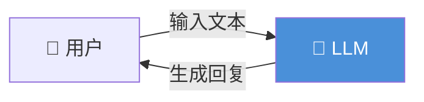
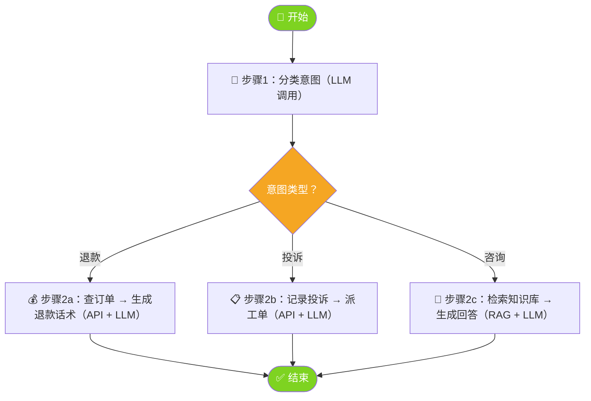
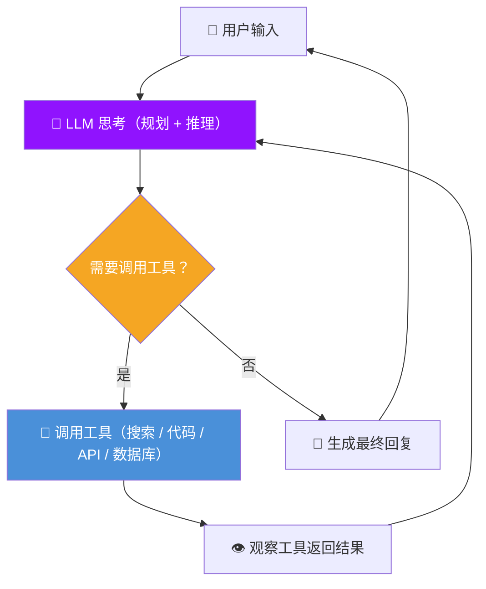
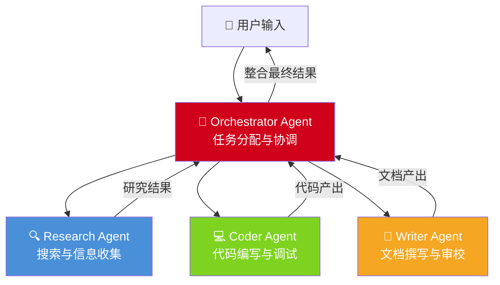
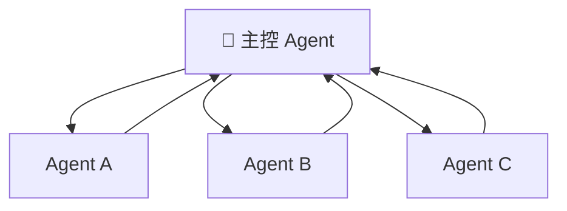
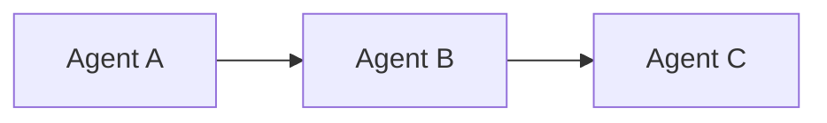
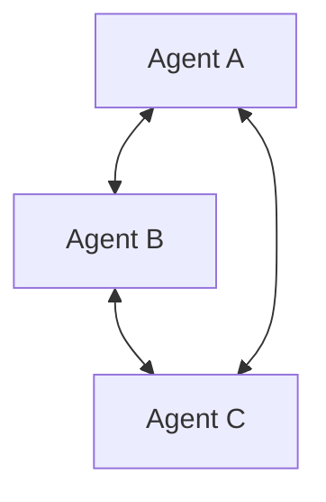
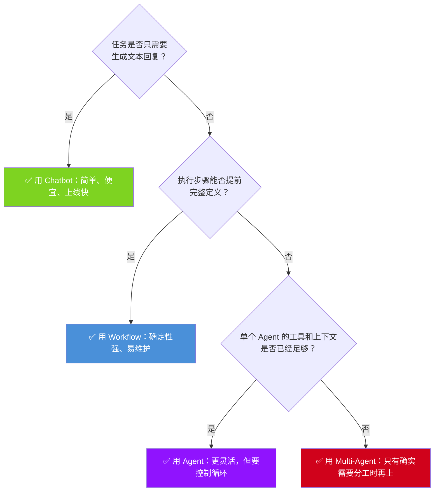

## 为什么要区分这四种形态？

在大模型时代，`Agent` 这个词被严重滥用。很多人把任何“接了 `LLM` 的程序”都叫 `Agent`，但工程实践里，`Chatbot`、`Workflow`、`Agent`、`Multi-Agent` 是四种完全不同的系统形态：

- 它们的**决策者不同**
- 它们的**执行路径不同**
- 它们的**复杂度和维护成本不同**
- 它们适合解决的**问题类型也不同**

搞清楚边界，不是为了咬文嚼字，而是为了**在项目开始时就选对架构**。很多项目真正需要的只是一个 `Chatbot` 或一个 `Workflow`，却过早引入了 `Agent Loop`、多角色协同、共享记忆，最后把简单问题做复杂了。

---

## 先记一个最短判断法

遇到一个系统，先问四个问题：

1. 它是不是只负责“接收输入，然后生成一段回复”？如果是，大概率是 `Chatbot`。
2. 它的步骤是不是开发者提前写死的？如果是，大概率是 `Workflow`。
3. 它会不会自己决定“下一步要不要调用工具、调用哪个工具、要不要继续循环”？如果会，那是 `Agent`。
4. 系统里是不是有多个相对独立的 `Agent` 在分工协作？如果是，那是 `Multi-Agent`。

> [!tip] 先抓本质
> 区分这四类形态，最关键不是看“有没有用 `LLM`”，而是看**谁在做决策**。

---

## 一、`Chatbot`（聊天机器人）

![[chatbot-cyberpunk.png]]

### 核心定义

`Chatbot` 是最简单的 `LLM` 应用形态：**用户输入 → 模型生成回复 → 返回给用户**。整个过程通常只有一轮推理，最多再加对话历史，不需要调用外部工具，不需要多步规划，也不需要自主循环。

### 一句话理解

`Chatbot` 的本质是：**它只负责“接话”**。

### 架构



### 关键特征

- **以文本生成作为核心能力**：给定上下文，生成下一段最合适的文本
- **通常不使用工具**：不查数据库、不调 `API`、不执行代码
- **没有自主决策循环**：模型不会自己判断“我还要不要再做一步”
- **实现成本最低**：非常适合作为第一版原型
- 典型场景：客服问答、闲聊、翻译、文案润色、角色扮演

### 代码示例

> [!info] 运行前准备
> 下面几段示例统一按 `DeepSeek` 的 `OpenAI-compatible` 接口来写。先执行：
> `bash "raw/C_Courses(课程)/A_Agent Learning Hub/Stage 0：理解 Agent 是什么/codes/bootstrap_env.sh"`
> `export DEEPSEEK_API_KEY="你的 DeepSeek Key"`
> 这会复用你当前的 `python3` 解释器创建一个本地 `.venv`，不会重复安装 `Python` 本体，也不会污染系统环境。示例里默认使用 `deepseek-v4-flash`。

可运行脚本：
[01_chatbot_deepseek.py](codes/01_chatbot_deepseek.py)

运行方式：

```bash
python "raw/C_Courses(课程)/A_Agent Learning Hub/Stage 0：理解 Agent 是什么/codes/01_chatbot_deepseek.py"
```

> [!tip] 判断标准
> 如果你的程序只在做“接收文本 → 调 `LLM` → 返回文本”，没有任何工具调用，也没有自主循环，那它就是 `Chatbot`。

---

## 二、`Workflow`（工作流）

![[workflow-cyberpunk.png]]

### 核心定义

`Workflow` 是**预定义、确定性的执行流程**。开发者在设计时就把步骤、分支、异常处理全部写好了，`LLM` 只是流程中某些节点的执行者，而不是流程的决策者。

### 一句话理解

`Workflow` 的本质是：**系统按剧本执行，模型只在局部出力**。

### 架构



### 关键特征

- **流程由开发者预定义**：节点顺序、分支条件、错误处理都写死在代码里
- **`LLM` 是节点，不是控制器**：它负责分类、总结、生成话术，但不决定流程怎么走
- **可预测、可测试**：相同输入通常走相同路径
- **非常适合上线生产**：因为稳定、可观测、方便审计
- 典型场景：客服分流、工单处理、内容审核流水线、固定 `RAG` 流程、邮件分类

### 代码示例

可运行脚本：
[02_workflow_deepseek.py](codes/02_workflow_deepseek.py)

说明：
这个版本把订单查询、工单创建、知识库检索都做成了本地 `mock`，可以直接跑通整条 `Workflow`。

运行方式：

```bash
python "raw/C_Courses(课程)/A_Agent Learning Hub/Stage 0：理解 Agent 是什么/codes/02_workflow_deepseek.py"
```

> [!tip] 判断标准
> 如果你能画出一张完整流程图，而且每条分支都能在代码里找到对应的 `if/else`、状态机或节点图，那它就是 `Workflow`。

---

## 三、`Agent`（智能体）

### 核心定义

`Agent` 的关键不在“会不会调用工具”，而在于**是否存在自主决策循环**。系统不再由开发者提前写死每一步，而是给模型一组工具和目标，让模型在执行过程中自己判断下一步应该做什么。

### 一句话理解

`Agent` 的本质是：**系统不是照剧本走，而是边做边决定下一步**。

### 架构



### 关键特征

- **存在 `Agent Loop`**：`Think → Act → Observe → Think`，直到模型判断任务完成
- **模型会主动做局部规划**：例如先搜资料、再比较、再写结论
- **工具调用是动态的**：是否调用、调用什么、调用几次，都由模型临时决定
- **路径不稳定**：相同输入可能走出不同的执行轨迹
- 典型场景：复杂检索、数据分析、代码生成与调试、自动化运维、开放式研究任务

### 代码示例

可运行脚本：
[03_agent_deepseek.py](codes/03_agent_deepseek.py)

说明：
这个版本带了两个本地工具：一个模拟 `web_search`，一个执行简短 `Python`。你可以直接观察 `Agent Loop` 如何决定调工具。

运行方式：

```bash
python "raw/C_Courses(课程)/A_Agent Learning Hub/Stage 0：理解 Agent 是什么/codes/03_agent_deepseek.py"
```

> [!tip] 判断标准
> 如果你的程序里有一个循环，`LLM` 在循环中不断决定“要不要再调工具、调哪个工具、是否结束”，那它就是 `Agent`。

---

## 四、`Multi-Agent`（多智能体）

### 核心定义

`Multi-Agent` 是多个 `Agent` 协同工作来完成复杂任务的架构。每个 `Agent` 有自己的角色、目标、工具集和上下文，它们之间通过某种协调机制交换信息、拆分任务、汇总结果。

### 一句话理解

`Multi-Agent` 的本质是：**不是一个人自己想办法，而是一组角色分工合作**。

### 架构



### 常见协调模式

原来的“三合一”图容易在 `Mermaid` 渲染时让标题压住节点，所以这里直接拆成三张更稳定的小图。

#### 模式 A：中心协调（`Orchestrator`）

由一个主控 `Agent` 负责拆任务、分发任务、汇总结果。它最像“项目经理”。



#### 模式 B：链式协作（`Pipeline`）

上一个 `Agent` 的输出直接成为下一个 `Agent` 的输入，适合有明确加工顺序的任务。



#### 模式 C：自由对话（`Debate`）

多个 `Agent` 彼此讨论、挑战、修正观点，最后再形成共识或交给裁判角色汇总。



### 关键特征

- **多角色分工**：每个 `Agent` 有独立职责
- **各自拥有局部上下文**：不一定共享完整消息历史
- **需要协调机制**：消息传递、共享内存、文件系统、任务队列都可能参与
- **系统复杂度显著上升**：编排、调试、评估都会更难
- 典型场景：复杂研究报告、模拟软件团队、跨领域分析、长链路自动化交付

### 代码示例

可运行脚本：
[04_multi_agent_deepseek.py](codes/04_multi_agent_deepseek.py)

说明：
这个版本会先让主控角色生成一个 `JSON` 计划，再把步骤分发给 `researcher`、`coder`、`writer` 三个角色执行，最后由 `writer` 汇总。

运行方式：

```bash
python "raw/C_Courses(课程)/A_Agent Learning Hub/Stage 0：理解 Agent 是什么/codes/04_multi_agent_deepseek.py"
```

> [!tip] 判断标准
> 如果系统里有多个相对独立的 `LLM` 实例，它们有各自的 `system prompt`、工具集、消息历史，并且彼此传递信息，那它就是 `Multi-Agent`。

---

## 五、四种形态放在一张表里看

| 维度 | `Chatbot` | `Workflow` | `Agent` | `Multi-Agent` |
|------|-----------|------------|---------|---------------|
| **谁在做决策** | 几乎没有决策，主要是生成回复 | 开发者写死流程 | `LLM` 在循环中做局部决策 | 多个 `LLM` 协同决策 |
| **工具调用** | 通常没有 | 有，但位置和时机固定 | 有，且由模型动态选择 | 有，且每个 `Agent` 可不同 |
| **执行路径** | 单步或短对话 | 预定义路径 | 动态路径 | 多条动态路径交织 |
| **是否有循环** | 无 | 通常无，或固定次数 | 有 `Agent Loop` | 多个 `Agent Loop` 外加协调循环 |
| **确定性** | 高 | 高 | 低 | 更低 |
| **开发复杂度** | 低 | 中 | 高 | 很高 |
| **调试难度** | 低 | 低 | 高 | 很高 |
| **适合场景** | 问答、翻译、文案 | 流程化业务 | 开放式复杂任务 | 多角色复杂协作 |

---

## 六、怎么选型？

做新项目时，按下面这棵树判断就够了：



> [!important] 核心原则
> 永远优先选择**能解决问题的最小复杂度方案**。大多数团队的问题，不是能力不够，而是过度设计。

---

## 七、最容易混淆的三个边界

### 1. `Chatbot` 和 `Workflow` 的边界

一个带 `RAG` 的问答系统，不一定就是 `Agent`。

- 如果步骤是固定的：`query → retrieve → rerank → generate`，那它是 `Workflow`
- 如果模型会自己决定“要不要检索、检索什么、检索几次”，那才更接近 `Agent`

关键区别不在“用了什么技术”，而在“**谁在决定下一步**”。

### 2. `Workflow` 和 `Agent` 的边界

像 `LangGraph` 这类框架，既能做 `Workflow`，也能做 `Agent`。关键看图中有没有一个由模型主导的回环：

- 如果是 `DAG`，节点和路径基本固定，那更像 `Workflow`
- 如果存在回到模型节点的循环，且循环是否继续由模型决定，那就是 `Agent`

### 3. `Agent` 和 `Multi-Agent` 的边界

一个系统里即使有很多次 `LLM` 调用，也不一定是 `Multi-Agent`。

- 如果这些调用共享同一个角色设定、同一个主要上下文，那通常还是单 `Agent`
- 只有当系统里存在**多个相对独立的角色**，并且它们之间真的在传递信息、协调任务，才算 `Multi-Agent`

---

## 八、常见误判

- **“调用了工具，所以一定是 `Agent`。”**
  不是。工具调用如果是代码提前写死的，那仍然是 `Workflow`。
- **“有多轮对话，所以一定不是 `Chatbot`。”**
  不是。只要本质上仍是“基于上下文生成下一句”，它依然可能是 `Chatbot`。
- **“有多个步骤，所以一定是 `Workflow`。”**
  不是。关键看步骤是不是开发者预先定义好的。
- **“有多个模型调用，所以一定是 `Multi-Agent`。”**
  不是。多次调用不等于多角色协同。

---

## 九、一句话总结

> `Chatbot` 负责接话，`Workflow` 负责按剧本执行，`Agent` 负责自己想下一步，`Multi-Agent` 负责一群角色分工合作。

如果你只记住一句判断标准，那就是：

> **先看谁在做决策，再看系统是否存在自主循环，最后看是不是多个独立角色在协同。**
