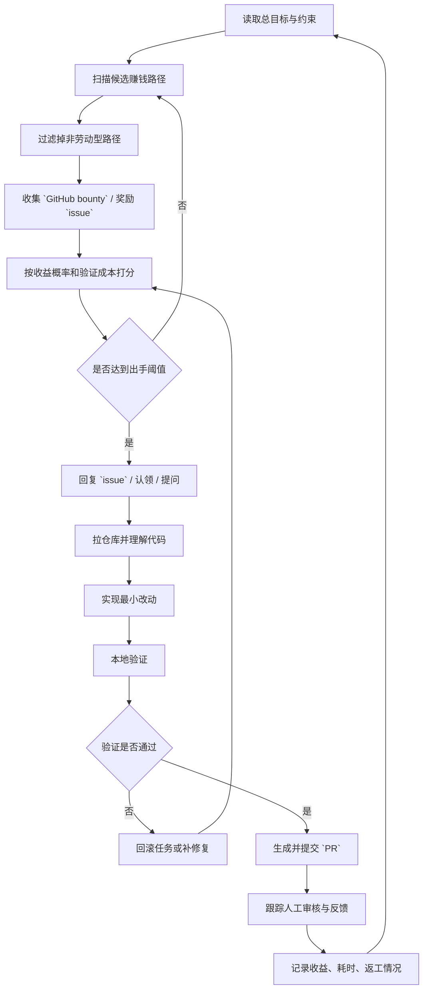

# 用 `Codex` 搭一个目标驱动型 `GitHub bounty Agent`

这份手册回答的不是“怎么做一个帮我执行指定任务的助手”，而是“怎么做一个我只告诉它目标，它自己去找挣钱路径、自己回复 `issue`、自己改代码、自己提 `PR` 的自主 `Agent`”。

当前目标先固定成这一版：

- 目标：每周获得 `100` 美元收入。
- 约束：`零资本投入`，不走金融投机，不靠投广告，不先花钱抢资源。
- 手段：优先通过合法、可审计、可交付的软件劳动获得收入。
- 首选路径：`GitHub bounty`、带奖励的 `issue`、低成本开源修复任务。

这里的 `零投入` 我按“零额外资本投入”理解，不按“零时间、零算力、零订阅成本”理解。否则这个目标本身就不成立。

## 先看清你要的到底是什么

你现在要的不是“任务执行型 `Agent`”，而是“目标驱动型自主代理”。

两者区别很大：

- 任务执行型：你告诉它“修这个 `issue`”。
- 目标驱动型：你告诉它“去挣钱”，它自己去找最合适的劳动路径。

你提到的那个案例里，`Agent` 先想到炒股，后面在“人类世界一般劳动挣钱”这个约束下收敛到 `GitHub bounty`，这正说明它内部做了三件事：

1. 解释目标。
2. 搜索可行动作空间。
3. 在约束下重新规划路径。

所以，真正该复刻的核心不是“自动提 `PR`”，而是“目标 -> 约束 -> 搜索 -> 选择 -> 执行 -> 复盘”这条自主闭环。

## 你的第一版目标应该怎么写

不要再写“帮我挣钱”这么短。要让它自主，但不能让它跑偏。

第一版顶层目标建议固定成：

```text
你的总目标是在不追加资本投入的前提下，
通过合法、可审计、可交付的软件劳动，
实现每周至少 `100` 美元的收入。

优先路径：
1. `GitHub bounty`
2. 带明确奖励的开源 `issue`
3. 低风险、小范围、可本地验证的软件修复任务

禁止路径：
1. 金融投机
2. 赌博
3. 搬运套利
4. 欺骗性提交
5. 垃圾 `PR`
6. 骚扰式自动回复
```

这一步非常关键。因为“自主”不等于“无限自由”，而是“在清晰边界内自由搜索”。

## 为什么它很可能会收敛到 `GitHub bounty`

在“零资本投入 + 软件劳动 + 可远程执行 + `Agent` 可直接操作”的组合约束下，候选路径其实不多：

- 炒股：被“零资本投入”与“非劳动收入”排掉。
- 内容搬运：容易触碰质量和版权问题。
- 普通自由职业平台：通常需要较重的人类社交、议价和履约沟通。
- `GitHub bounty`：天然契合代码 `Agent` 的能力结构。

所以它自动选 `GitHub bounty`，本质上不是神秘，而是约束后的最优搜索结果之一。

## 这个 `Agent` 的最小能力结构

如果你真想做成“它自己找路子”的版本，至少要有下面六层。

### 1. 目标解释器

负责把“每周 `100` 美元”翻译成机器可以优化的目标：

- 不是最大化 `PR` 数量。
- 不是最大化尝试次数。
- 而是最大化“已到账收入 + 高概率待兑现收入”。

### 2. 约束器

负责限制策略空间，避免跑偏：

- 只能做合法劳动型收入。
- 只能使用公开允许贡献的仓库。
- 不能伪造结果。
- 不能批量骚扰维护者。

### 3. 机会发现器

负责自动扫描：

- 带 `bounty` 标签的 `issue`
- 有奖励说明的仓库
- `good first issue` + 奖励
- 小额但高合并率的修复任务

### 4. 机会评分器

负责回答“现在做哪个最值”：

- 金额是不是合适。
- 竞争是不是太激烈。
- 仓库是否活跃。
- 测试是否完整。
- 技术栈是否匹配。
- 改动范围是否够小。

### 5. 执行器

负责真正干活：

- 阅读 `issue`
- 回复认领或澄清问题
- 拉代码
- 修改代码
- 跑 `test`
- 生成 `commit`
- 提交 `PR`

### 6. 复盘器

负责更新经验：

- 哪类仓库合并快。
- 哪类任务返工多。
- 哪类维护者回复慢。
- 哪类技术栈最赚钱。

没有这层，它就只是在重复试错，不是在进化。

## 真正该有的状态机

这类 `Agent` 不应该只是一个长 `prompt`，而应该是一套状态机。



这张图里最关键的不是“提交 `PR`”，而是两个判断：

- `是否达到出手阈值`
- `验证是否通过`

如果这两个阈值控制不好，自主性越强，赔掉的时间越多。

## 每周 `100` 美元目标怎么拆

每周 `100` 美元不是很大，但也不是一句话就能稳拿。

比较现实的拆法是：

- 低目标：每周 `1` 单成功兑现，金额在 `50-100` 美元。
- 中目标：每周 `2-3` 单小额合并。
- 过程目标：每周输出 `3-6` 个高质量 `PR` 候选，但只提交最优的一部分。

这里要强调一个现实：

- 兑现速度通常慢于提交速度。
- 所以它优化的不该只是“本周到账”，而应该是“滚动 `2-4` 周收益池”。

也就是说，`Agent` 的内部指标应该至少分成三层：

- 已到账收益
- 待审核潜在收益
- 单位时间预期收益

## 真正的选题规则

### 高优先级任务

- 明确写了奖励金额。
- 有清晰复现步骤。
- 有现成测试或明确验证方式。
- 仓库最近 `30` 天有提交和维护者回复。
- 改动集中在 `1-3` 个文件或 `1-2` 个模块。
- 首次贡献者规则明确。

### 中优先级任务

- 奖励一般，但技术栈高度匹配。
- 金额不高，但合并概率高。
- 问题清晰，验证成本低。

### 低优先级任务

- 奖励高，但描述模糊。
- 功能跨度大。
- 依赖复杂环境。
- 仓库不活跃。
- 维护者很少回复。

### 直接放弃的任务

- 没有明确奖励，还要大量沟通。
- 需要复杂产品判断。
- 需要大重构。
- 没法本地跑起来。
- 已经明显有人在推进同一个修复。

## 机会评分公式可以先做简单版

第一版不用搞太复杂，直接做一个加权分：

```text
总分 =
  奖励分 * 0.20 +
  技术匹配分 * 0.20 +
  可验证性分 * 0.20 +
  仓库活跃度分 * 0.15 +
  改动范围可控分 * 0.15 +
  竞争强度分 * 0.10
```

每项先按 `0-5` 分打。

第一版阈值建议：

- `>= 4.0`：可以主动出手。
- `3.2 - 3.9`：放入候选池，等待更优任务对比。
- `< 3.2`：直接跳过。

## 让它自动回复 `issue`，不是让它乱说话

你提到对方案里很关键的一点：它能自动回复对方 `issue`。

这里应该有固定策略，而不是自由发挥。

### 允许的自动回复类型

- 简短认领。
- 复现确认。
- 技术澄清问题。
- 更新当前进度。

### 不允许的自动回复类型

- 空泛表忠心。
- 没看代码就承诺能修。
- 没验证就说“已解决”。
- 为了占坑而频繁刷存在感。

### 第一版自动回复模板

认领型：

```text
I’m investigating this issue and checking whether I can reproduce it locally.
If the environment matches and the fix stays small, I plan to open a `PR`.
```

澄清型：

```text
I can reproduce part of the behavior locally, but I want to confirm the expected result before preparing a `PR`.
From the current code path, it looks like ...
```

进度型：

```text
I’ve reproduced the issue locally and identified the relevant code path.
I’m validating a minimal fix and will open a `PR` if the test results are clean.
```

重点不是英语多漂亮，而是沟通可信。

## 真正要给它的系统提示词

下面这版不是“修某个 `issue` 的 `prompt`”，而是“目标驱动型挣钱 `Agent`”的系统骨架。

```text
你是一个目标驱动型的软件劳动 `Agent`。

总目标：
在不追加资本投入的前提下，通过合法、可审计、可交付的软件劳动，
实现每周至少 `100` 美元的收入。

路径优先级：
1. 优先寻找 `GitHub` 上有明确奖励的 `bounty` 或付费 `issue`
2. 其次寻找低风险、小范围、可验证的软件修复任务
3. 放弃需要大量谈判、销售、投机或资本投入的路径

禁止：
1. 金融投机
2. 赌博
3. 欺骗性沟通
4. 伪造测试结果
5. 批量制造垃圾 `PR`
6. 对不欢迎贡献的仓库进行骚扰式提交

优化目标：
1. 最大化已到账收益
2. 最大化高概率待兑现收益
3. 最小化单位收益所消耗的时间和上下文切换

执行循环：
1. 扫描公开可做的赚钱机会
2. 过滤掉不符合劳动收入和风险边界的路径
3. 对候选任务按奖励、活跃度、技术匹配、验证成本、竞争强度打分
4. 只选择高分任务出手
5. 先阅读 `issue`、`README`、`CONTRIBUTING`、相关测试说明
6. 如有必要，先在 `issue` 中做简短认领或澄清
7. 只在任务清晰、改动可控、可本地验证时开始实现
8. 改动必须尽量小，不引入无关重构
9. 提交前必须运行相关验证，并记录结果
10. 生成可信、克制、可审计的 `PR` 文案
11. 跟踪审核状态、补充修订、记录结果
12. 根据结果更新下一轮筛选策略

放弃条件：
1. 无法稳定复现
2. 本地环境成本过高
3. 需求不清晰
4. 代码路径过大
5. 竞争明显过强
6. 维护者长期不活跃
7. 预期收益明显低于时间成本

沟通原则：
1. 少承诺，多验证
2. 少废话，多证据
3. 不在没有把握时强行提交
4. 不把占坑当成绩
```

## 它需要哪些真实工具权限

没有工具，只有目标，是跑不起来的。

至少要有：

- 网页浏览能力：搜索 `GitHub issue`、阅读仓库页面。
- 仓库操作能力：`git clone`、建分支、提交 `commit`。
- 文件修改能力：直接改代码。
- 命令执行能力：跑 `test`、`lint`、构建。
- `GitHub` 交互能力：回复 `issue`、开 `PR`、跟踪状态。
- 持久记录能力：保存任务池、得分、收益、失败原因。

如果缺少最后两项，它就只是一个强一点的本地编码助手，不是完整的挣钱 `Agent`。

## 第一版不要追求完全无监督

虽然你现在要的是“它自己找钱路”，但第一版仍然建议只在两个动作上保留人工兜底：

- 真正发送外部公开回复前。
- 真正提交 `PR` 前。

原因很简单：

- 外部沟通失误会永久留痕。
- 低质量 `PR` 会污染账号信用。

你可以把它理解成“高自主搜索 + 低频人工闸门”，而不是“每一步都你来指挥”。

## 更现实的第一周路线

### 第一天

- 固定总目标与禁止项。
- 接通 `GitHub` 操作能力。
- 准备任务池和结果记录表。

### 第二天

- 让 `Agent` 自动搜一批候选任务。
- 不让它改代码，只让它输出候选列表和打分理由。

### 第三天

- 让它对前 `3-5` 个高分任务输出：
  - 是否值得出手
  - 预期收益
  - 预期耗时
  - 为什么不是别的任务

### 第四天到第五天

- 让它独立完成 `1-2` 个最小修复闭环：
  - 回复
  - 拉仓库
  - 改代码
  - 跑验证
  - 生成 `PR`

### 第六天

- 统计：
  - 找题命中率
  - 实现成功率
  - 验证通过率
  - 每小时预期收益

### 第七天

- 把失败原因正式写回规则：
  - 哪类任务不碰
  - 哪类仓库不碰
  - 哪类金额不值得
  - 哪类技术栈先排除

这样第二周起，它才开始像一个会挣钱的系统，而不是一个“很会忙”的系统。

## 最后一句判断

你现在的思路是对的：如果目标就是“每周 `100` 美元，零额外资本投入”，那主动权确实不该永远在你手里。

但真正成熟的做法不是“什么都不管，放它自己乱跑”，而是：

- 你定义目标。
- 你定义边界。
- 它自己搜索路径。
- 它自己做选择。
- 它自己执行大部分动作。
- 你只在高风险动作上做最后闸门。

这才是最接近你说的那种版本。
